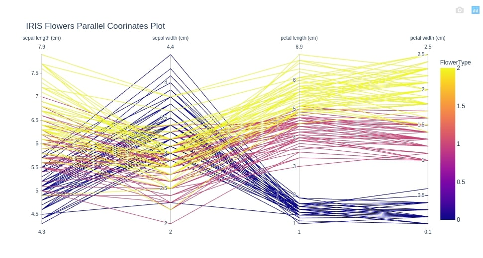

<!-- Purposes of the visualization; (1 point)
What information you have learned from the visualization; (1 point)
What information is hidden or not easy to tell from the visualization; (1 point)
Benefits and drawbacks of this type of visualization. (2 points) -->

# First visualization

The first visualization I chose for it to be analyzed is a plot of the famous [IRIS dataset](https://en.wikipedia.org/wiki/Iris_flower_data_set), retrieved from [this](https://coderzcolumn.com/tutorials/data-science/how-to-plot-parallel-coordinates-plot-in-python-matplotlib-plotly) page; the plot I'm referring to is displayed in Figure 1. The IRIS dataset is a multivariate dataset containing 50 samples from each of three species of Iris, a flower; every sample consists of four features: sepal length, sepal width, petal length and petal width.

{width=650px}

## Brief explanation

This plot is a **parallel coordinates** visualization; this means that, instead of plotting every pair of features in two dimensions, we plot all of them into parallel axis and we connect them with polylines. Each of these polylines represent one sample of the database; if these lines cross each other, this usually means that some type of inverse correlation exists between the two features.

## Purposes

The main purpose of this plot is to highlight relations that occur between the four features on the samples of the database, like every other parallel coordinates plot. In particular, with this plot the author probably wanted to find a pattern in the data, _i.e._ if the samples from the three types of flower have some feature value in common or if the data is just random. The author probably is also searching for inverse relations between the different features, for instance if the sepal length is inversely proportional with the sepal width. However, these considerations are done in the next subsection.

## Inferred information

Even if this particular plot is a little bit cluttered and the colors are not the best that could be chosen (as we'll see later in this section), some information can be inferred.

First of all, we can notice that the variable values are quite sparse for some features but more concentrated on others. We can observe these phenomenas, for example, in the sepal width and petal length axes: in the former, the distribution of values is quite sparse, with values of _"flower type 0"_ which vary from 2 cm to 4.4 cm on a scale that goes from 2 cm to 4 cm. In the latter, however, we can notice a pretty concentrated distribution, with feature values for the same flower which vary from 1 cm to 2 cm on a scale that goes from 1 cm to 6.9 cm.

We can also notice some outliers: for instance, there is a sample of _"flower type 0"_ that has a sepal width of ~2.3 cm, while the average is around 3.5 cm. Other outliers are visible for _"flower type 2"_, though are less clear due to color mixing.

Besides this, we can still notice some patterns in the data: for instance, we can see that flowers of type 0 have usually smaller sepal length than the others, while they have a higher sepal width. Remaining on this, we can also notice that flowers of this type have both smaller petal length and petal width of the others. Similar information can be inferred also for the other types of flower.

As a last remark, we can notice that sepal length and sepal width are in inverse correlation with each other, and the same applief for sepal width and petal length; we can notice this from the crossing polylines. For the same reason, we can say that petal length and petal width are in direct correlation, since the groups of lines (lines for type of flower) don't intersect.

## Benefits and drawbacks

The main benefit of this visualization in general is the high dimensionality of it: in fact, if we had to represent these correlations with other two-dimensional plots (for instance with index charts), we would have needed a graph for each couple of features. This might could have worked with this particular dataset, since it's composed by only four features, but with higher dimensional datasets this could be a total nightmare. Other advantages that derive from this are the high scalability and the compactness of the visualization: if we had to add another feature, in fact, the graph size would stay almost the same, and overall we can represent a high amount of data in a relatively small space.

The main drawback of this visualization is the overlaying of data lines for common data values: as we can also see from this particular plot, it is sometimes difficult to infer some particular pattern, and this is due to the clutterness that comes with a high amount of lines. Another cause of this are, in my opinion, the colors: these have to be chosen wisely, because too similar color are likely to confuse the reader.
However, two solutions can be implemented to solve this problems: changing the axes order and choosing the colors wisely. The latter is trivial, and the first ensures that lines don't cross too many times.

A final problem that regards only this particular plot is the legend: even if it's technically correct, it's not trivial to understand which type of flower corresponds to which color. Personally, I would improve this graph modifying the lengend on the right from a continuous spectrum of colors to a more clear legend that states that blue is flower 0, magenta is flower 1 and yellow is flower 2.